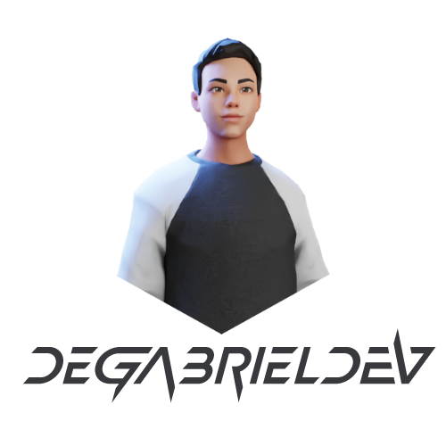

<p align="center">
   
  </p>

  <p align="center">
  
  
  
</p>

# :clipboard: Sobre o projeto

Bem-vindo ao meu Portfólio! Aqui, convido você a mergulhar no meu universo, explorando detalhes sobre minha jornada no mundo do desenvolvimento e descobrindo alguns dos projetos mais significativos que tive a oportunidade de criar. Tudo cuidadosamente reunido em um único espaço para proporcionar uma experiência incrível e revelar a essência do meu trabalho. Explore, inspire-se e conheça o melhor do que construí até agora.

Abaixo podemos ver o resultado final do projeto. Espero que gostem!

<br>
<p align="center">
   
  </p>

# 🔗 Acesse o site com o link abaixo.

- [Gabriel Silva | Portfólio](degabrielofi.vercel.app/)

## :computer: Tecnologias utilizadas

Este projeto foi desenvolvido com as seguintes tecnologias:

- [React.js](https://pt-br.reactjs.org/)
- [Node.js](https://nodejs.org/en/)
- [JavaScript](https://www.javascript.com/)
- [Bootstrap](https://getbootstrap.com/)
- [Styled-Components](https://styled-components.com/)
- [HTML](https://developer.mozilla.org/pt-BR/docs/Web/HTML)
- [CSS](https://developer.mozilla.org/pt-BR/docs/Web/CSS)

## 🖥️ Instalando Front-End <MyPortfolio>

Para instalar o projeto e acessar o front-end, siga estas etapas:

🖨️ #Clonando o repositório do Github:

```
$ git clone https://github.com/degabrielofi/MyPortfolio
```

📂 #Acessando respectiva pasta:

```
$ cd Web
```

🗃️ #Instalação de packages:

```
$ npm i .
```

✅ #Inicializar projeto:

```
$ npm run start
```

## 📶 Instalando Back-End

Para instalar o projeto, e acessar o back-end, siga estas etapas:

🖨️ #Clonando o repositório do Github:

```
$ git clone https://github.com/degabrielofi/MyPortfolio
```

📂 #Acessando respectiva pasta:

```
$ cd Server
```

🗃️ #Instalação de packages:

```
$ npm i .
```

✅ #Inicializar projeto:

```
$ node index.js
```

## 🤝 Colaboradores

Agradecemos às seguintes pessoas que contribuíram para este projeto:

<table>
  <tr>
    <td align="center">
      <a href="#" title="defina o titulo do link">
        <br>
        <sub>
          <b>Gabriel Silva</b>
        </sub>
      </a>
    </td>
  </tr>
</table>

## 📝 Licença

Esse projeto está sob licença. Veja o arquivo [LICENÇA](LICENSE.md) para mais detalhes.

##

<p align="center">
  
  </p>
