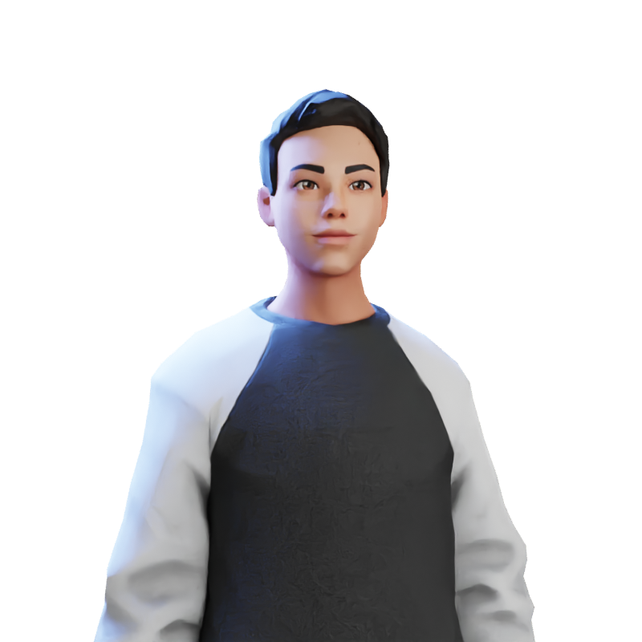

<p align="center">
   
  </p>

# :clipboard: Sobre o projeto

Este é o Portfólio, aonde você poderá ver um pouco sobre mim e como entrei no mundo do desenvolvimento, e ainda alguns dos meus principais projetos. Tudo isso em um só lugar.

Abaixo podemos ver o resultado final do projeto. Espero que gostem!

<br>
<p align="center">
   
  </p>

# 🔗 Acesse o site com o link abaixo. 

- [Gabriel Silva | Portfólio](degabrielofi.vercel.app/)


## :computer: Tecnologias utilizadas
Este projeto foi desenvolvido com as seguintes tecnologias:
- [React.js](https://pt-br.reactjs.org/)
- [Node.js](https://nodejs.org/en/)
- [JavaScript](https://www.javascript.com/)
- [Bootstrap](https://getbootstrap.com/)
- [Styled-Components](https://styled-components.com/)
- [HTML](https://developer.mozilla.org/pt-BR/docs/Web/HTML)
- [CSS](https://developer.mozilla.org/pt-BR/docs/Web/CSS)


## 🌐 Para iniciarlizar o projeto utilize o comando abaixo:
```bash

#Clonando o repositório do Github: 
$ git clone https://github.com/degabrielofi/MyPortfolio

#Instalar alguns packages:

$ npm i emailjs-com infinite-react-carousel react-bootstrap react-dom react-elastic-carousel react-icons react-router-dom styled-components sweetalert2 sweetalert2-react-content

#Inicializar pasta Web:
$ npm run start
 
```

## 

<p align="center">
  
  </p>
